[Obsidian](https://help.obsidian.md/Home), [latex math](http://tug.ctan.org/info/undergradmath/undergradmath.pdf), [more latex math](https://en.wikibooks.org/wiki/LaTeX/Mathematics), [mermaid](https://mermaid.js.org/intro/), [tikz](https://tikz.dev/), [pgfplot](https://tikz.dev/pgfplots/)  chemfig tikz-cd circuitikz and all latex package can also be used. Too bad I never found love in chemistry.

```latex
\usepackage{tikz}
\begin{document}
  \begin{tikzpicture}[domain=0:4]
    \draw[very thin,color=gray] (-0.1,-1.1) grid (3.9,3.9);
    \draw[->] (-0.2,0) -- (4.2,0) node[right] {$x$};
    \draw[->] (0,-1.2) -- (0,4.2) node[above] {$f(x)$};
    \draw[color=red]    plot (\x,\x)             node[right] {$f(x) =x'$};
    \draw[color=brown]   plot (\x,{sin(\x r)})    node[right] {$f(x) = \sin x$};
    \draw[color=pink] plot (\x,{0.05*exp(\x)}) node[right] {$f(x) = \frac{1}{20} \mathrm e^x$};
  \end{tikzpicture}
\end{document}
```

```latex
\usepackage{chemfig}
\begin{document}

\definesubmol\fragment1{

    (-[:#1,0.85,,,draw=none]
    -[::126]-[::-54](=_#(2pt,2pt)[::180])
    -[::-70](-[::-56.2,1.07]=^#(2pt,2pt)[::180,1.07])
    -[::110,0.6](-[::-148,0.60](=^[::180,0.35])-[::-18,1.1])
    -[::50,1.1](-[::18,0.60]=_[::180,0.35])
    -[::50,0.6]
    -[::110])
    }

\chemfig{
!\fragment{18}
!\fragment{90}
!\fragment{162}
!\fragment{234}
!\fragment{306}
}

\end{document}
```

$$
1+2=3
$$
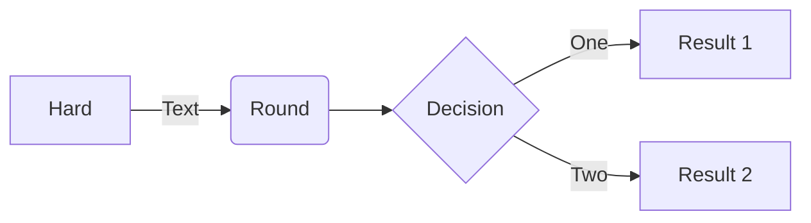

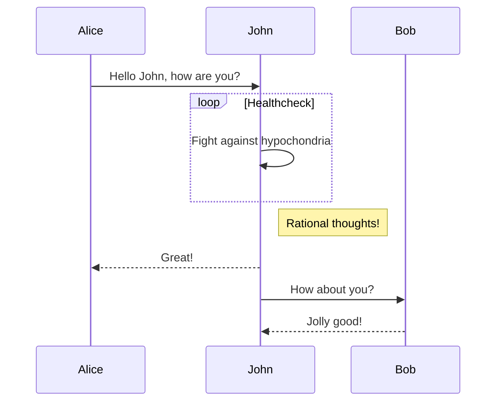
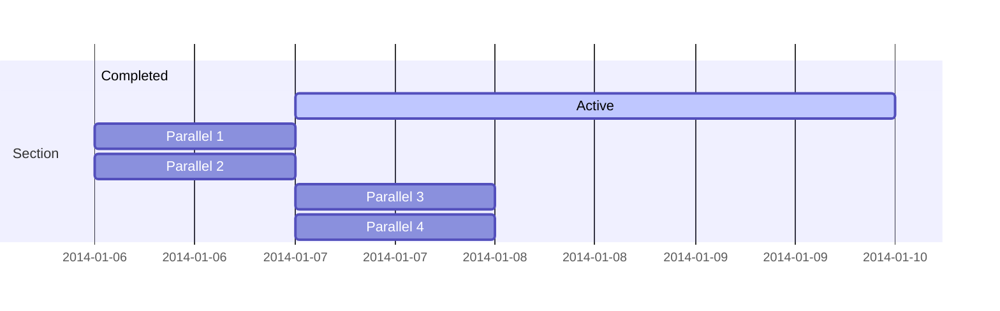
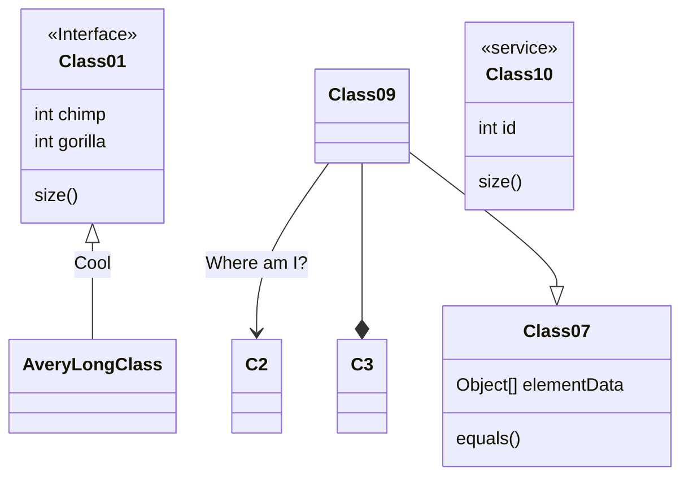
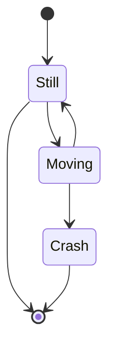
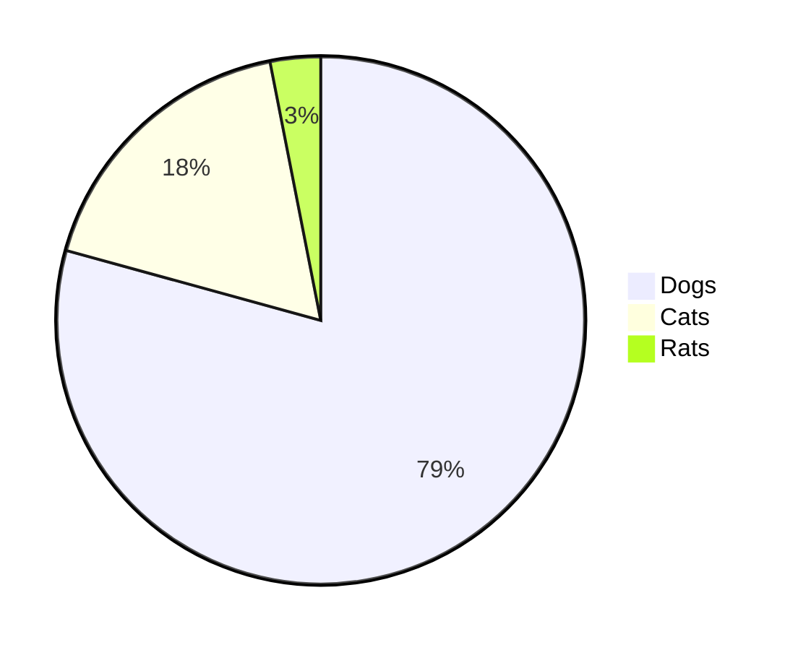
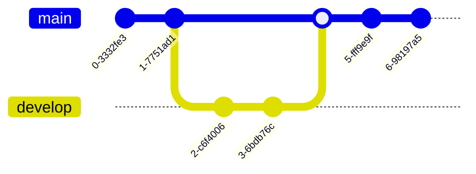
```mermaid
gantt
    title Git Issues - days since last update
    dateFormat  X
    axisFormat %s

    section Issue19062
    71   : 0, 71
    section Issue19401
    36   : 0, 36
    section Issue193
    34   : 0, 34
    section Issue7441
    9    : 0, 9
    section Issue1300
    5    : 0, 5
```
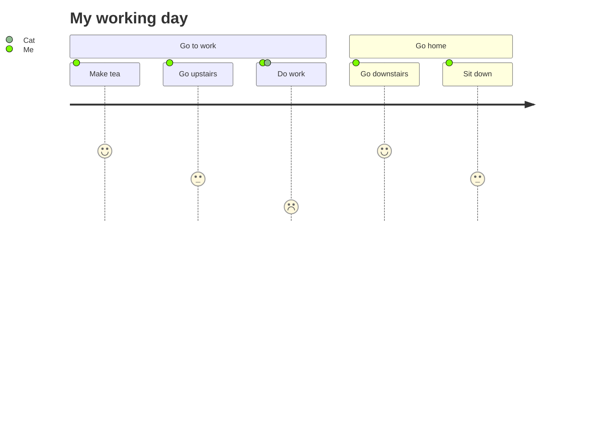
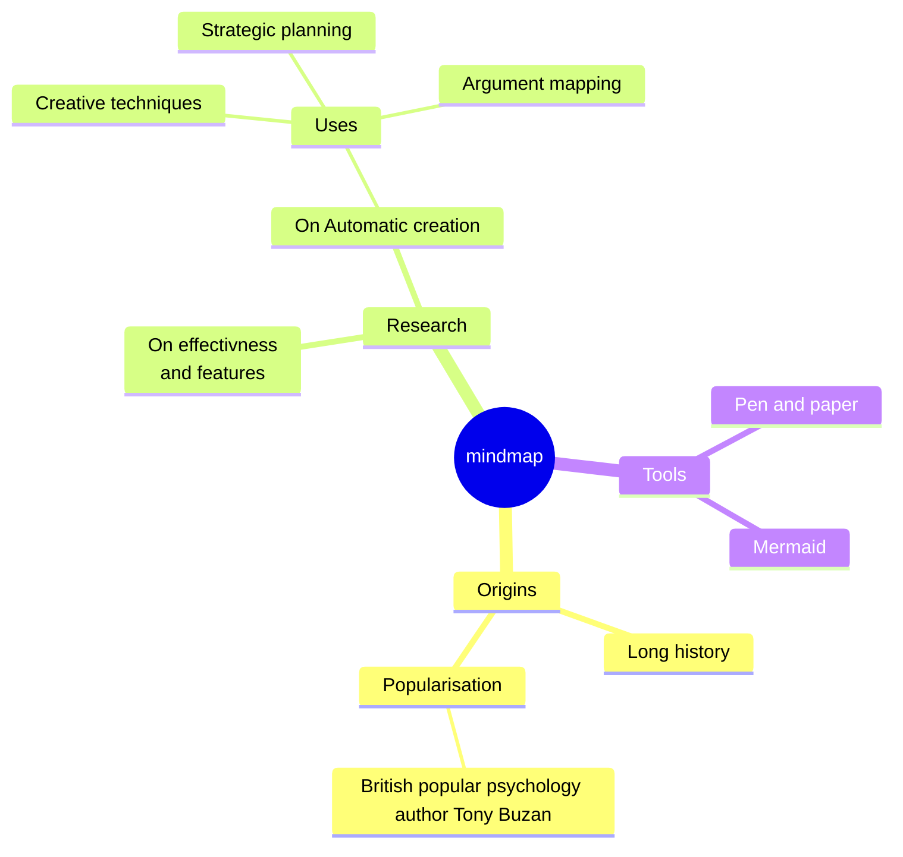

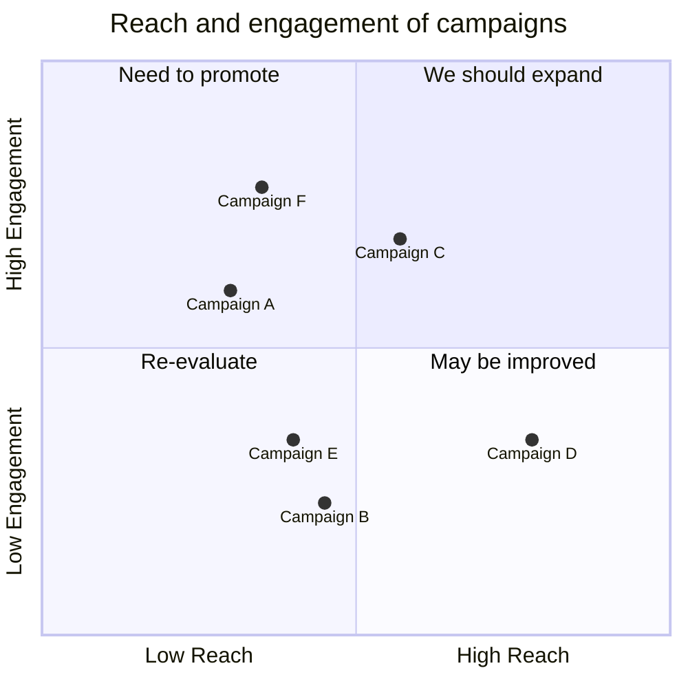

